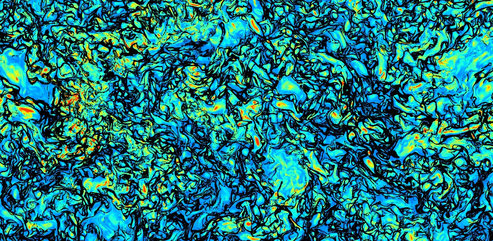

## Hi there 👋

My name is Lukas Codispoti.
I am a computational scientist with a background in mechanical engineering and a passion for programming.
My main interests are numerical simulations, artificial intelligence and energy topics.
In my current role as doctoral student in computational fluid dynamics at ETH Zürich
I develop highly efficient numerical applications with tools like `mpi`, `hdf5` and `fftw` and
perform large-scale simulations to study turbulence and novel LES models.

I also generate beautiful images like this one:

<!-- 

    

 -->

What I most enjoy is solving very difficult problems and writing code to do just that.

    &nbsp;
    &nbsp;
    &nbsp;
    &nbsp;
    &nbsp;
    &nbsp;
    &nbsp

<!--
**lukascodispoti/lukascodispoti** is a ✨ _special_ ✨ repository because its `README.md` (this file) appears on your GitHub profile.
-->

